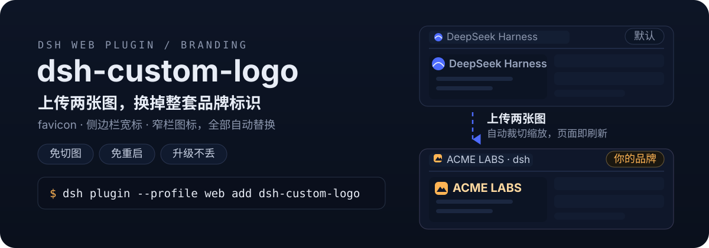
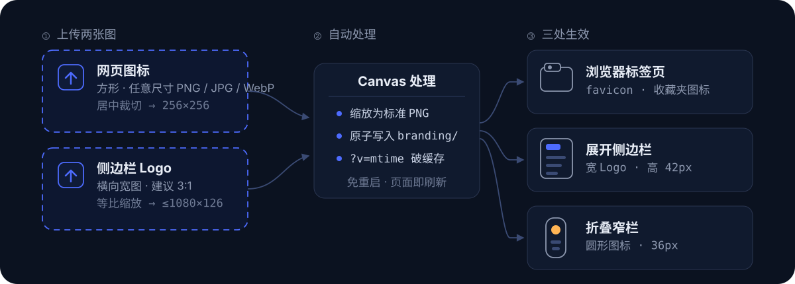

<p align="center">
  
</p>

<h3 align="center">上传两张图，换掉 DeepSeek Harness 整套品牌标识</h3>

<p align="center">
  
  
  
  
</p>

<p align="center"><a href="./README_EN.md"><strong>English</strong></a> · 简体中文</p>

---

给 [DeepSeek Harness](https://github.com/deepseek-ai)（dsh）换上你自己的品牌：安装后在设置弹窗里多一个「品牌设置」分区（与「通用 / 模型 / 插件」并列），选一张方形图、一张横向宽图，插件自动裁切缩放并替换 favicon 与侧边栏 Logo——**免切图、免重启、升级不丢**。

## 两张图，三处生效

<p align="center">
  
</p>

- **浏览器标签页** — 方形图居中裁切为 favicon，收藏夹图标同步更新
- **展开侧边栏** — 横向宽图等比缩放，以 42px 高度替换原生文字标
- **折叠窄栏** — 方形图缩为 36px 圆形图标

图片处理全部在浏览器端完成，上传后页面自动刷新生效，不需要重启服务，也不需要手动准备任何尺寸的切图。

## 安装

**方式一：从 npm 安装（推荐）**

```bash
dsh plugin --profile web add dsh-custom-logo
```

**方式二：直接从 GitHub 添加**

```bash
dsh plugin --profile web add github:dawsondx/dsh-custom-logo
```

**方式三：clone 后安装（审阅源码 / 参与贡献）**

```bash
git clone https://github.com/dawsondx/dsh-custom-logo.git
dsh plugin --profile web add ./dsh-custom-logo
```

安装后重启 dsh（`dsh start --profile web` 或你的启动脚本），设置弹窗即出现「品牌设置」分区。

## 使用

1. 打开设置弹窗，在左侧导航选择「品牌设置」
2. 「网页图标」卡片 → 选择图片 → 自动处理并刷新
3. 「侧边栏 Logo」卡片 → 选择图片 → 自动处理并刷新
4. 不满意随时重传；想回原版点「恢复默认」

两张卡片的当前图会以缩略图预览；面板支持中英文，跟随 dsh 界面语言。

## 工作原理

- 客户端把选中的图片用 canvas 缩放为标准 PNG（方形 256×256 居中裁切；宽图 ≤1080×126 等比），POST 到本机 dsh 服务
- 服务端写入 `<DSH_HOME>/branding/`（`logo-128.png` / `logo-64.png` / `logo-wide.png`），原子落盘
- 每次 index 请求时动态注入：favicon `<link>` 重写 + CSS 隐藏原生 SVG（按稳定的 `viewBox` 属性匹配，不受构建哈希/类名顺序影响）、以背景图绘制自定义 Logo，URL 带 `?v=<mtime>` 自动破缓存
- 图片保存在 dsh 用户目录而非插件包内，插件升级不丢品牌图；dsh 升级也不覆盖本插件（patch 层挂载在用户 profile）

## 安全性

- 上传/重置接口仅接受 **loopback 来源**（校验 peer socket 地址，非可伪造的 Host 头），局域网访问者无法改你的品牌图
- 仅接受 PNG（魔数校验），单次上传上限 8MB，文件名白名单，不接受任意路径写入

## 常见问题

**上传后没变化？** 硬刷新一次（Ctrl+Shift+R）。注入 URL 已带版本号，一般普通刷新即可。

**宽图比例多少合适？** 侧边栏品牌区高 42px，3:1（如 126×42、540×180）最饱满；更宽的图会按高度等比缩窄，不会变形。

**折叠窄栏的图标好小？** 窄栏是 36px 圆形位，方形图会被缩到这个尺寸，建议主体图形不要太贴边。

**怎么卸载？** `dsh plugin --profile web remove dsh-custom-logo`，再删掉 `~/.dsh/branding/` 下的 `logo-*.png` 即完全还原。

**升级 dsh 后还生效吗？** 插件通过用户 profile 的 patch 层挂载，dsh 自身升级不覆盖；CSS 锚点使用稳定属性，小版本 UI 更新通常无需跟进。若 dsh 大改版重画了品牌区，欢迎提 issue。

## 开发

```bash
git clone https://github.com/dawsondx/dsh-custom-logo.git
cd dsh-custom-logo
npm run check   # 语法检查 lib/index.js 与 lib/client.js
```

无构建步骤：`lib/index.js`（服务端，ESM）与 `lib/client.js`（浏览器，手写 `__ModuleLoader__` bundle）均为单文件、零第三方依赖。

## 致谢

- 灵感与交互模式参考 [dsh-token-data](https://github.com/dawsondx/dsh-token-data) 的侧边栏面板实现

## 许可证

[MIT](./LICENSE)
